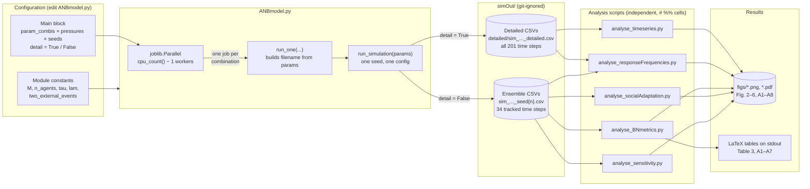
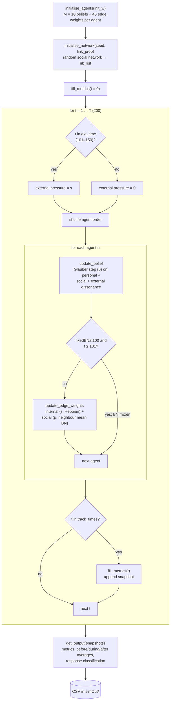

# System Overview

How the pieces of the repository fit together: a parameter sweep in `ANBmodel.py` writes one CSV per
simulation, and five independent analysis scripts read those CSVs and produce the paper's figures and
tables. For details, see [running-simulations.md](running-simulations.md), [model.md](model.md) and
[analysis.md](analysis.md).

## Pipeline

The analysis scripts don't import anything from `ANBmodel.py`. They find their input files by exact
filename, so the filename that `run_one` builds is the only link between the two halves. If a parameter
appears in the filename with a different format, or a run is missing, the analysis script fails when it
calls `pd.read_csv`. For the runs each script expects, see
[running-simulations.md](running-simulations.md#runs-needed-for-each-analysis-script).

## Inside one simulation

In ensemble mode, `track_times` holds only t = 0, 1, 91–100, 141–150, 191–200 and 200. In detailed mode it
holds every step. `get_output` adds the averaged rows `t = 95.5` (before), `145.5` (during) and `195.5`
(after). Only the `95.5` row carries the response dummies (compliant, resilient, resistant, …) that the
analysis scripts count. See [model.md](model.md) for the update equations and the response definitions.
